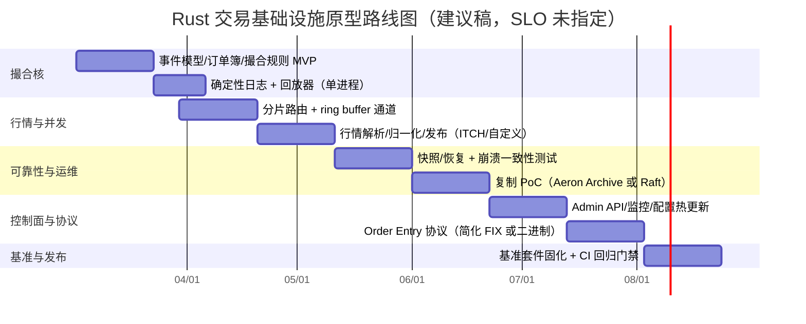

# Rust 低延迟高性能交易基础设施设计深度研究报告：实时确定性撮合与行情处理

## 执行摘要

本报告面向“Rust 实现的低延迟、高吞吐、确定性（deterministic）撮合与实时行情处理基础设施”，目标是**模块化、可扩展、性能可验证**的系统。用户未给出明确约束（例如撮合吞吐、端到端延迟 SLO、产品形态是交易所/撮合网关/做市内部引擎、是否要求跨机房容灾等），因此以下方案以“可配置 + 可量化基准”的原则设计，并显式标注“需在立项时固化的关键 SLO”。  

核心结论如下（精炼但可落地）：

系统架构上，推荐将系统分为**数据平面（Data Plane）**与**控制平面（Control Plane）**：  
数据平面以“**按市场/合约分片（sharding）+ 每分片单线程确定性事件循环**”为主，借助 SPSC/MPSC 环形队列（ring buffer）连接外部 I/O 与撮合核；控制平面使用 Tokio 等异步框架承载管理 API、配置、监控与运维工具，避免干扰撮合热路径。Tokio 的定位是“可靠的异步 I/O 平台”，适合控制面与非关键路径。 citeturn20search1

确定性优先的撮合核，需要强约束“输入事件顺序 + 数据结构顺序”。在 Rust 里，`HashMap` 默认哈希算法**随机播种**以抵御 HashDoS，这会导致迭代顺序不可依赖（且运行期种子不可预测），因此撮合关键结构（例如价格层级、订单索引、撮合队列）不应依赖 `HashMap` 的迭代顺序；如需可重复迭代顺序，应优先使用 `BTreeMap`（按 key 有序存储）。 citeturn17search0turn17search6

极致低延迟场景下，网络与内核路径是高杠杆优化点：  
可分阶段演进：先用 `mio`/`socket2` 等“薄抽象的非阻塞 I/O”实现稳定基线（`mio` 主张尽量少的 OS 抽象开销）。 citeturn20search2  
再根据瓶颈引入 io_uring（共享 ring、减少 syscall）、AF_XDP（UMEM 零拷贝 RX/TX ring）、DPDK（用户态轮询、内核旁路）、甚至 RDMA verbs。io_uring 文档明确其通过用户态/内核态共享 ring 以提升 I/O 效率并尽可能避免拷贝。 citeturn20search0turn16search1turn16search0turn16search2

开源生态方面，Rust “完整可直接投产的交易所级撮合引擎”仍相对稀缺，但关键拼图在快速完善：  
撮合/订单簿有 `matching-core`（项目自述从生产复制逻辑但“未经过生产环境检验”）、`OrderBook-rs` 等；FIX/FAST/SBE 有 FerrumFIX、FASTlib、SBE 相关实现（含 Aeron 组织维护的 SBE 参考实现）；低延迟 IPC/消息传输可选 Aeron（Rust 侧有 rusteron，项目自述用于 GSR 实时交易栈）。 citeturn5view0turn6view1turn6view2turn5view7turn27search6turn24view0turn15search2

合规与审计并非“后置需求”：  
美国 CAT/Rule 613 强调对订单从生成到路由、撤单、修改、成交等事件的集中跟踪与数据记录；欧盟 MiFID II（RTS 25）强调业务时钟对 UTC 的可追溯性与精度要求。建议从 MVP 开始采用“事件溯源（event sourcing）+ 可重放日志 + 可证明时间戳点位”的设计，以减少未来合规改造成本。 citeturn4search3turn4search11turn4search0turn4search1

---

## 开源生态与项目清单

本节给出“可直接复用/参考的 Rust 与相关开源项目”清单，按撮合、行情、协议/编解码、通信/并发与系统工具分类。由于 Rust crate 与 GitHub 项目数量巨大，“绝对穷尽”不现实；本清单以**交易基础设施最相关**为筛选标准，覆盖“你真正会在工程里用到”的核心项目，并提供成熟度判断依据（活跃度、commit/issue、是否声明停更等）。

### 撮合引擎与订单簿

| 项目 | 简述 | 成熟度（主观分级） | 许可证 | GitHub（代码形式给出） | 关键指标（抓取时点） |
|---|---|---|---|---|---|
| matching-core | Rust 撮合“核心库”；仓库提示“从生产 copy 逻辑，但未经过生产环境检验，仅供学习”。 citeturn5view0 | 原型/学习导向 | （仓库可见，需最终核对） | `https://github.com/llc-993/matching-core` citeturn5view0 | 130⭐ / 72🍴；4 commits。 citeturn5view0turn22view0 |
| OrderBook-rs | 高性能线程安全限价订单簿/撮合，强调并发与可扩展；MIT。 citeturn6view1turn5view2 | 活跃（工程化较强） | MIT citeturn6view1 | `https://github.com/joaquinbejar/OrderBook-rs` citeturn6view1 | 296⭐ / 59🍴；146 commits。 citeturn6view1turn22view2 |
| matching-engine（pgellert） | Rust 撮合引擎 + Raft 复制；README 指出用“Raft 状态机复制”实现容错与网络分区容忍。 citeturn5view1turn6view0 | 研究/论文实现（小规模 commits） | （需核对仓库） | `https://github.com/pgellert/matching-engine` citeturn6view0 | 63⭐ / 8🍴；2 commits。 citeturn6view0turn22view1 |
| orderbook-rs（dgtony） | 基础撮合引擎，明确为学习 Rust/交易系统内部机制；单线程“reactive module”。 citeturn5view4 | 学习/示例 | （需核对仓库） | `https://github.com/dgtony/orderbook-rs` citeturn5view4 | 项目定位更偏教学（自述）。 citeturn5view4 |
| Serum DEX（Solana） | Solana 上链 CLOB 代表作之一；Apache-2.0；有多次 release。 citeturn18search0 | 成熟但 history 停留在 2022 版本（需评估） | Apache-2.0 citeturn18search0 | `https://github.com/project-serum/serum-dex` citeturn18search0 | 702⭐ / 357🍴；11 releases（最新 2022-04-20）。 citeturn18search0 |
| OpenBook（Solana program） | Serum 社区分支；Apache-2.0；作为 on-chain CLOB 仍具参考价值。 citeturn18search15 | 成熟（但 v1 系列节奏较慢） | Apache-2.0 citeturn18search15 | `https://github.com/openbook-dex/program` citeturn18search15 | 210⭐ / 157🍴；有 release。 citeturn18search15 |
| OpenBook v2 | 许可证策略更复杂：主体 MIT，但编译 Solana program 所需部分可通过 feature gated 启用 GPL；并提供带 sha256 的 release 产物（利于可验证构建/可追溯）。 citeturn18search3turn18search23 | 活跃（2024 有多次 release） | MIT +（可选 GPL 部分） citeturn18search3 | `https://github.com/openbook-dex/openbook-v2` citeturn18search3 | 约 245⭐/143🍴（release 页面数据）；release 产物含 build sha256。 citeturn18search23 |
| Phoenix v1（Solana） | On-chain order book；主许可证 BUSL-1.1，并声明已被 OtterSec 审计（报告在仓库）。 citeturn18search2 | 成熟（但许可更偏商用） | BUSL-1.1 citeturn18search2 | `https://github.com/Ellipsis-Labs/phoenix-v1` citeturn18search2 | 仓库声明含审计与安全策略。 citeturn18search2 |

观察与启示：  
在“撮合核”上，Rust 开源更多处于“核心数据结构/学习实现/链上撮合”三类：纯撮合（matching-core、OrderBook-rs）与链上撮合（Serum/OpenBook/Phoenix）可提供确定性与数据结构灵感；但要打造交易所级完整系统，仍需补齐网关、风控、审计与可观测性等工程面。matching-core 甚至直接提示未经过生产检验，提醒我们：**开源可借鉴结构与思路，但必须用基准与形式化/属性测试把正确性拉到工程级**。 citeturn5view0

### 行情处理与 Feed Handler

| 项目 | 简述 | 成熟度 | 许可证 | GitHub（代码形式） | 关键指标/要点 |
|---|---|---|---|---|---|
| itchy-rust | NASDAQ ITCH 5.0 解析器；自述“zero-allocation（感谢 nom）”，在笔记本约 20M msg/s（作者自测）。 citeturn23view2 | 活跃/可复用（协议解析强相关） | MIT（仓库标注） citeturn23view2 | `https://github.com/adwhit/itchy-rust` citeturn14search0 | 51⭐/14🍴（搜索摘要）；强调零分配与高吞吐（自述）。 citeturn14search0turn23view2 |
| marketdata（JoeYang） | ITCH 5.0 multicast 接收、维护 per-symbol order book，并 rebroadcast 下游；提供 tick-by-tick 与 conflated 模式。 citeturn14search2 | 新项目（需评估代码质量/测试） | （需核对） | `https://github.com/JoeYang/marketdata` citeturn14search2 | README 明确 multicast→feed handler→下游架构。 citeturn14search2turn23view7 |
| DataFeedHandler（Rust+Go） | 明确分层：Rust 数据平面负责原始网络 I/O/协议解析/批处理转发；Go 控制平面做订阅、健康检查与指标。 citeturn23view8 | 架构范例（值得直接借鉴分层） | （需核对） | `https://github.com/alexanderhaire/DataFeedHandler` citeturn14search10 | 提供“数据面/控制面”切分模板。 citeturn23view8 |
| matching-engine-rs（amankrx） | “构建快速撮合引擎”项目，包含 ITCH parser 等模块化结构（偏学习/研究）。 citeturn14search20 | 学习/研究 | （需核对） | `https://github.com/amankrx/matching-engine-rs` citeturn14search20 | 强调性能与 ITCH 规范。 citeturn14search20 |

行情链路启示：  
ITCH/UDP multicast 的工程重点不是“解析代码能跑”，而是：乱序/丢包检测、gap 恢复、快照/增量对齐、多源仲裁（A/B feed arbitration）、以及下游 conflation 策略。你可以直接借鉴 IronSBE 项目所列的“市场数据模式”（A/B 仲裁、gap detection、snapshot recovery 等）作为功能 checklist。 citeturn5view8

### FIX/FAST/SBE 与编解码、交易协议库

| 项目 | 协议/范围 | 成熟度 | 许可证 | 链接（代码形式） | 指标/备注 |
|---|---|---|---|---|---|
| FerrumFIX | FIX 家族：解析、校验、错误恢复、(反)序列化；目标逐步走向完整合规（路线式）。 citeturn5view5turn6view2 | 活跃（大体量仓库） | Apache-2.0 + MIT citeturn6view2 | `https://github.com/ferrumfix/ferrumfix` citeturn6view2 | 434⭐/79🍴；614 commits。 citeturn6view2turn22view3 |
| fix-rs（jbendig） | FIX engine（多版本）；作者声明 2017 起暂停开发。 citeturn13search0 | 停更/不建议新系统依赖 | 双许可 MIT/Apache-2.0（README） citeturn13search20 | `https://github.com/jbendig/fix-rs` citeturn13search0 | 143⭐/29🍴；无 releases。 citeturn13search16turn13search12 |
| quickfix-rs（arthurlm） | QuickFIX C++ 的 Rust binding；docs.rs 说明“可用于生产”。 citeturn13search11turn23view5 | 可用但依赖 C++/FFI 风险 | 仓库显示含 MIT 且有 “Unknown LICENSE-APACHE” citeturn23view5 | `https://github.com/arthurlm/quickfix-rs` citeturn23view5 | 46⭐/18🍴；2025 有 release。 citeturn13search15turn23view5 |
| rs-fastlib / fastlib | FIX FAST decoder/encoder；docs.rs 说明提供 FAST decoder。 citeturn5view7turn13search9 | 小众但关键（交易所行情常见） | （需核对仓库） | `https://github.com/mcsakoff/rs-fastlib` citeturn13search9 | crate 提供 FAST 解码能力。 citeturn5view7 |
| IronSBE | Rust SBE 实现：zero-copy 解码、schema codegen、多传输（TCP/UDP/共享内存）、并列出 A/B 仲裁等行情模式（项目自述）。 citeturn5view8 | 新但方向正确（需审查基准真实性） | （仓库可见，需最终核对） | `https://github.com/joaquinbejar/IronSBE` citeturn5view8 | 6⭐/2🍴；强调“sub-µs、百万 msg/s”（自述）。 citeturn5view8 |
| Aeron SBE 参考实现 | SBE 的 GitHub 参考实现，包含多语言（含 Rust）；用于低延迟金融消息。 citeturn27search6turn27search2 | 成熟（参考实现地位） | Apache-2.0 citeturn27search6 | `https://github.com/aeron-io/simple-binary-encoding` citeturn27search6 | 4,006 commits（仓库摘要）；强调 low-latency financial messages。 citeturn27search6turn27search2 |
| rkyv | 零拷贝（zero-copy）反序列化框架；适合内存映射/共享内存场景。 citeturn3search3turn3search14 | 成熟（生态使用广） | （仓库可见，需核对） | `https://github.com/rkyv/rkyv` citeturn3search3 | 卖点：zero-copy 与性能。 citeturn3search3turn3search14 |

协议选型经验法则（面向低延迟撮合/行情）  
FIX 生态强但实现成本高：FerrumFIX 活跃且覆盖“解析/校验/序列化”等底层能力，但其目标是“逐步达到完整合规”，意味着你需要接受阶段性缺口或自行补齐。 citeturn5view5turn6view2  
对于内部高频链路，SBE/自定义二进制 + 严格 schema 往往更容易把延迟做“可预测”。Aeron 官方强调其设计目标是“最高吞吐、最低且最可预测延迟”，并与 SBE 集成以获得最佳编解码性能。 citeturn27search1

### 通信、并发与系统基础组件

| 组件/项目 | 用途 | 许可证 | 链接（代码形式） | 关键要点 |
|---|---|---|---|---|
| mio | 非阻塞 I/O 与事件通知；强调尽量少的 OS 抽象开销。 citeturn20search2 | MIT citeturn20search2 | `https://github.com/tokio-rs/mio` citeturn20search2 | 适合数据平面“薄 I/O 层”。 |
| tokio-uring | io_uring 支持的 Rust runtime（Tokio 体系）。 citeturn2search3 | MIT citeturn22view5 | `https://github.com/tokio-rs/tokio-uring` citeturn2search3 | 用于文件/网络 I/O 的更低 syscall 开销路径（需评估成熟度）。 |
| io_uring（内核接口） | Linux 异步 I/O：用户态/内核态通过共享 ring 提交/完成请求，尽可能避免拷贝。 citeturn20search0 | — | `man io_uring(7)` | 适合作为“写日志/快照”与部分网络 I/O 的演进方向。 citeturn20search0 |
| rtrb | 预分配、构造后零分配的 wait-free SPSC ring buffer。 citeturn3search6 | — | `https://docs.rs/rtrb` | 适合作为分片间数据通道/撮合热路径队列。 |
| Disruptor（LMAX） | 并发 ring buffer；用于低延迟高吞吐的异步事件处理架构。 citeturn27search4 | Apache-2.0（LMAX repo） | `https://github.com/LMAX-Exchange/disruptor` citeturn27search0 | 可作为“撮合事件流水线”的经典模式参考。 citeturn27search4 |
| disruptor-rs | Rust 实现 Disruptor pattern（ring buffer、padding、防伪共享等）。 citeturn23view1 | MIT citeturn23view1 | `https://github.com/KhaledYassin/disruptor-rs` citeturn23view1 | 作为 Rust 侧工程实现参考。 |
| Aeron | 低延迟消息传输（UDP unicast/multicast + IPC）；目标高吞吐、低且可预测延迟。 citeturn27search5turn27search9 | Apache-2.0（其仓库） | `https://github.com/aeron-io/aeron` citeturn27search1 | Aeron Archive 记录/回放；Aeron Cluster 提供容错全序。 citeturn27search9 |
| rusteron | Aeron C API 的 Rust wrapper；由 GSR 赞助维护，并自述用于其实时交易栈；含 archive/record-replay 组件。 citeturn24view0turn15search2 | Apache-2.0 citeturn24view0 | `https://github.com/gsrxyz/rusteron` citeturn24view0 | 33⭐/10🍴；716 commits。 citeturn24view0 |
| AF_XDP（内核） | 为高性能包处理优化的地址族；通过 XDP_REDIRECT 将包导向用户态，配合 UMEM 与 RX/TX ring。 citeturn16search1turn16search5 | — | `https://www.kernel.org/doc/html/latest/networking/af_xdp.html` citeturn16search1 | 是“内核旁路”但仍在内核生态内的折中路径。 |
| afxdp-rs | Rust 使用 AF_XDP 的接口封装，目标按“正确性→性能→易用性”排序。 citeturn23view3 | Apache-2.0 citeturn23view3 | `https://github.com/aterlo/afxdp-rs` citeturn23view3 | 118⭐/27🍴；61 commits。 citeturn23view3 |
| DPDK（官方） | DPDK 文档体系覆盖用户态包处理工具链与驱动（内核旁路方案之一）。 citeturn16search0 | — | `https://doc.dpdk.org/guides/` citeturn16search0 | 最适合极致性能，但工程复杂度高。 |
| dpdk-sys | Rust 的 DPDK bindings（绑定 DPDK 17.02）；适合作为探索/原型，但版本偏老。 citeturn25view0 | MIT（README） citeturn25view0 | `https://github.com/lemonrock/dpdk-sys` citeturn25view0 | 2⭐；406 commits；绑定版本老，需谨慎。 citeturn25view0 |
| rdma-core / ibverbs | RDMA 用户态库与守护进程（rdma-core）；用于 verbs 的基础。 citeturn16search2 | 多许可证（仓库） | `https://github.com/linux-rdma/rdma-core` citeturn16search2 | 适合超低延迟/高吞吐点对点链路，但部署门槛高。 |
| rust-ibverbs | Rust 对 ibverbs（rdma-core）bindings。 citeturn23view4 | — | `https://github.com/jonhoo/rust-ibverbs` citeturn2search2 | 需小心 unsafe/资源生命周期。 |
| core_affinity | 线程绑核（CPU pinning）工具，降低调度抖动。 citeturn3search0 | — | `https://docs.rs/core_affinity` | 是低延迟基准测试与生产部署常用手段。 |
| hwlocality | 基于 hwloc 的拓扑/NUMA 感知与 CPU 绑定能力。 citeturn3search12turn3search13 | — | `https://github.com/HadrienG2/hwlocality` citeturn3search12 | 解决 NUMA/亲和性“可视化与程序化配置”。 |
| hdrhistogram | 延迟直方图（常用于 p50/p99/p999）；其 Rust 实现强调固定内存占用、记录样本为常数开销。 citeturn27search3 | Apache-2.0/MIT（仓库可核对） | `https://github.com/HdrHistogram/HdrHistogram_rust` citeturn27search3 | 适合做“延迟分布”基准与线上监控。 citeturn27search3 |

---

## 架构模式与组件拆解

本节从“撮合引擎、订单簿、行情管线、网络、持久化、风控、管理与监控、测试与 fuzzing”逐一拆解，并给出推荐的 Rust crate/并发模型/内存与零拷贝策略。

### 推荐的整体架构

关键指导原则：  
撮合与行情处理不是普通业务服务。性能目标通常不是平均值，而是**尾延迟（tail latency）可预测**。因此系统要最大化“可控性”：可控的执行顺序、可控的内存分配、可控的线程调度、可控的 I/O 路径。

下面给出一个“数据面/控制面分离”的参考架构（Mermaid）：

```mermaid
flowchart LR
  subgraph ControlPlane[控制平面 Control Plane]
    AdminAPI[Admin/API\n(gRPC/HTTP)]
    Config[配置中心/热更新]
    Observ[Metrics/Tracing/Logs]
    Deploy[发布/灰度/回滚工具]
  end

  subgraph DataPlane[数据平面 Data Plane]
    Ingress[Order Entry Gateways\n(FIX/TCP, WS, Binary)]
    Risk[Pre-trade Risk\n(限额/权限/风控)]
    Router[事件路由\n(symbol->shard)]
    subgraph Shards[撮合分片 Shards]
      M0[Shard-0\n单线程确定性 loop]
      M1[Shard-1\n单线程确定性 loop]
      Mn[Shard-N\n单线程确定性 loop]
    end
    MD[Market Data Builder\n(增量/快照/聚合)]
    Pub[Market Data Publisher\n(UDP multicast/IPC)]
    Journal[Append-only Journal\n(WAL/Event Sourcing)]
    Snap[Snapshots\n(周期快照)]
  end

  Ingress --> Risk --> Router --> M0
  Router --> M1
  Router --> Mn
  M0 --> MD
  M1 --> MD
  Mn --> MD
  MD --> Pub
  M0 --> Journal
  M1 --> Journal
  Mn --> Journal
  Journal --> Snap

  AdminAPI --> Config --> Ingress
  Observ --> Ingress
  Observ --> M0
  Observ --> MD
  Observ --> Journal
  Deploy --> ControlPlane
```

这种结构的要点：撮合线程不跑 async runtime；它只做确定性事件循环，处理顺序由路由器保证。控制面可以使用 Tokio 等成熟异步栈。Tokio 的定位是“事件驱动、非阻塞 I/O 平台”，适合承载大量网络连接与控制逻辑。 citeturn20search1

### 并发模型的关键取舍

撮合系统的并发模型常见三类：单线程撮合、分片单线程撮合、共享簿多线程撮合。面向“确定性”与“低尾延迟”，推荐“分片单线程撮合”，并将跨分片交互变成显式消息传递（ring buffer/channel），避免在订单簿上加锁。

| 并发模型 | 典型实现 | 优点 | 风险/代价 | 适用建议 |
|---|---|---|---|---|
| 每市场/每合约单线程撮合 | 单线程事件循环处理该 market 的全部事件；dgtony/orderbook-rs 也采用“单线程 reactive module per pair”思路。 citeturn5view4 | 最强确定性；极少锁；尾延迟可控 | 多核利用不足；热点合约单点瓶颈 | 适合作为最小正确性基线与回放引擎 |
| 按 symbol 分片（多 shard、每 shard 单线程） | Router 将事件路由至固定 shard；shard 内含多个 orderbooks；shard 线程可绑核（core_affinity）。 citeturn3search0 | 核心路径仍确定性；可线性扩展到多核 | 需要设计跨 shard 的一致性（如组合保证金/跨市场风控） | **推荐默认方案**（可兼顾确定性与扩展） |
| 多线程共享订单簿（锁/无锁结构） | `DashMap`/lock-free orderbook；OrderBook-rs 强调并发访问与“lock-free data structures”方向（需读代码验证）。 citeturn5view2turn6view1 | 理论吞吐高；读多写少场景可提升 | 复杂、难验证；易引入非确定性；尾延迟更难控 | 不建议作为第一版撮合核 |

实现层建议：数据平面的事件通道优先使用“构造后零分配”的 ring buffer。`rtrb` 明确主打“预分配、构造后无分配”的 wait-free SPSC ring buffer。 citeturn3search6  
如果你要采用 Disruptor 风格流水线，LMAX 官方将其描述为“并发 ring buffer，面向低延迟高吞吐的异步事件处理架构”；Rust 侧可参考 disruptor-rs 的工程实现（padding、防伪共享、锁自由设计）。 citeturn27search4turn23view1

### 订单簿与撮合规则模块化

撮合核（Matching Engine Core）建议拆为以下可插拔模块（以 trait + feature flags 组织）：

订单模型：订单类型、价格/数量表达、时间优先规则。  
建议：内部使用定点整数（ticks、lots），避免浮点不确定性；时间戳只在明确点位打标，并将“撮合顺序”由序列号而非 wall clock 决定。

订单簿数据结构：  
可选路径包括：  
使用树结构管理价格层级（如 `BTreeMap<Price, Level>`）以获得确定性迭代；`BTreeMap` 官方定义为“按 key 有序存储”。 citeturn17search6  
或使用更 cache-friendly 的结构（数组/压缩树/critbit 等）。链上撮合（Serum）中常见为更节省计算的树结构；而 matching-core 的基准文章强调其对数据结构与内存布局做了大量优化（包括 SoA、ARM/自适应 radix tree/对象池等），但这类基准往往是自述，需要你用自己的硬件与工作负载复现。 citeturn0search0turn5view0

撮合规则：  
将规则抽象为 `MatchPolicy`（价格-时间优先、pro-rata、隐藏单、冰山单等）；将“撮合结果”抽象为事件（trade、fill、cancel、reject、book_update）。在 event sourcing 架构下，撮合输出事件就是你的审计源数据。

### 行情处理管线

行情处理可拆为：接入（UDP multicast/FIX）、解码（ITCH/FAST/SBE）、规范化（统一内部 schema）、构建（L1/L2/L3 book、增量/快照）、发布（multicast/IPC/WS）、以及 conflation（下游节流）。

实践提示：  
ITCH 解析器 itchy-rust 自述零分配且在笔记本上可达约 20M msg/s（自测）。这类项目非常适合做“协议解析层”的基线，但仍需补齐“丢包/乱序/gap 恢复/快照对齐”。 citeturn23view2  
IronSBE 项目在 README 中把 A/B feed arbitration、gap detection、snapshot recovery 等列为“市场数据模式”，可当作功能 checklist。 citeturn5view8

对于多语言系统，“Rust 数据面 + 其他语言控制面”分层是一条成熟路径：DataFeedHandler 直接给出了 Rust 处理 raw I/O/解析/批处理转发，Go 处理动态订阅/健康检查/指标的范式。 citeturn23view8

### 网络、通信与序列化建议

网络入口（Order Entry）建议分级：  
第一阶段：TCP + `mio` 非阻塞，或控制面用 Tokio，数据面用 `mio`。`mio` 明确定位为 low-level non-blocking I/O，并强调尽量少的 OS 抽象开销。 citeturn20search2  
第二阶段：极致低延迟时才考虑 AF_XDP/DPDK/RDMA（见后文性能章节）。

内部消息与序列化：  
事件在进程内建议“结构体直接传递 + ring buffer 复用”，避免序列化；跨进程/跨机建议优先 SBE（schema 驱动、固定布局）或 Aeron + SBE。Aeron 官方强调其设计目标是“最高吞吐、最低且最可预测延迟”，并与 SBE 集成以获得最佳编解码性能。 citeturn27search1turn27search5  
若你需要共享内存/内存映射文件上的零拷贝反序列化，可选 rkyv。 citeturn3search3turn3search14

---

## 性能瓶颈与延迟优化策略

本节按“你会真实遇到的瓶颈”组织：序列化、内存分配、缓存/NUMA、线程调度、网络栈与内核旁路、持久化 I/O。

### 序列化与数据拷贝

典型瓶颈：  
在行情与订单入口，协议解码与字段拷贝会成为 CPU 热点；而在日志/复制链路，序列化格式直接决定带宽与 cache miss。

策略：  
优先 schema 驱动二进制：SBE（参考实现明确用于低延迟金融消息）并可与 Aeron 配合。 citeturn27search6turn27search1  
对“文件/共享内存”场景，使用零拷贝反序列化（rkyv）。 citeturn3search3turn3search14  
协议解析层尽量 zero-allocation：如 itchy-rust 自述采用 nom 并实现零分配。 citeturn23view2

### 无 GC 设计与内存布局

Rust 默认无 GC，但你仍可能被“隐式分配与扩容”击穿尾延迟。低延迟撮合的内存策略建议：

在撮合热路径避免堆分配：  
ring buffer 预分配事件对象；订单对象池（slab/arena）；批处理 `SmallVec` 之类的栈上小集合（matching-core 的基准文章也强调此类策略，但仍需自行复现验证）。 citeturn0search0turn5view0

结构体布局与 cacheline：  
采用 SoA（Structure of Arrays）或“紧凑的 price level + order链表/数组索引”；并对共享计数器/序列号做 cacheline padding（Disruptor 生态强调 padding 防伪共享）。 citeturn27search4turn23view1

### CPU 亲和性、NUMA 与调度抖动

生产环境的“延迟抖动”常来自调度迁移、NUMA 跨节点访问、以及中断与应用线程竞争。

建议：  
撮合/行情关键线程绑核（core_affinity），并在 NUMA 机器上使用 hwloc/hwlocality 做拓扑感知与绑核策略。 citeturn3search0turn3search12  
把“网络收包线程/IRQ”与“撮合线程”做隔离（同核竞争会恶化尾延迟），并把测量方法固化到基准方法论里（见后文）。

### 网络栈：从 socket 到内核旁路

这是最重的性能杠杆，但也最容易把工程复杂度推爆。推荐“分级路线”：

基础路径：`mio`/Tokio + 调参  
适合 MVP 与大多数中低频场景。Tokio 是事件驱动非阻塞 I/O 平台；mio 更贴近 OS、开销更低、适合热路径 I/O。 citeturn20search1turn20search2  
Linux 侧可逐步启用 busy poll、调优网卡队列/中断亲和性等（具体参数需按硬件验证）。

io_uring：降低 syscall 与拷贝开销  
io_uring 被定义为 Linux 异步 I/O 设施，通过用户态/内核态共享 ring buffer 提交与完成请求，并在可能时避免缓冲区拷贝。 citeturn20search0  
Rust 可用 tokio-uring 作为探索（但需评估成熟度与可观测性）。 citeturn2search3

AF_XDP：在内核生态内的高性能包处理  
内核文档将 AF_XDP 定义为“为高性能包处理优化的地址族”；其机制基于 XDP_REDIRECT，把包导向用户态 UMEM，并使用 RX/TX ring。 citeturn16search1turn16search5  
Rust 可通过 afxdp-rs 访问 AF_XDP，并明确其目标优先级是“正确性→性能→易用性”。 citeturn23view3

DPDK：极致吞吐/极致低延迟的用户态包处理  
DPDK 官方提供完整文档体系，覆盖用户态驱动、工具与指导。 citeturn16search0  
Rust bindings（dpdk-sys）存在，但绑定版本较老（仓库 README 指向 DPDK 17.02），更适合研究/原型而非直接投产依赖。 citeturn25view0

RDMA（ibverbs）：点对点极低延迟链路  
rdma-core 是 RDMA 用户态库与守护进程集合。 citeturn16search2  
Rust 可用 rust-ibverbs 之类 bindings，但这会引入大量 unsafe/资源生命周期复杂度，需要强测试与审计。 citeturn2search2turn23view4

### 持久化：日志、快照与写放大

撮合系统的持久化一般不是“数据库事务”，而是“顺序追加的事件日志 + 周期快照”。目标是：  
写入开销小、可回放、可比对、可做灾备复制。

可行组合：  
日志：append-only 文件（mmap + 顺序写）或 Aeron Archive（record/replay）；Aeron 文档明确 Aeron Archive 支持将流记录到持久存储并用于回放，Aeron Cluster 提供容错全序。 citeturn27search9  
快照：定期生成 orderbook 状态快照；与日志序列号对齐；支持从快照+增量重建。  
若引入存储引擎，需谨慎：例如 sled 自述仍“quite young/unstable”，且 on-disk format 可能变化导致迁移成本。 citeturn26search3

---

## 安全、确定性、容错与合规

### 确定性设计要点

确定性目标应定义为：  
给定**同一输入事件序列**（包含所有订单/撤单/修改与外部触发），撮合输出必须**字节级一致**（或至少语义一致）并可重放。

关键措施：  
避免依赖随机播种哈希：Rust `HashMap` 默认哈希算法随机播种以抵御 HashDoS。 citeturn17search0  
因此：  
撮合关键结构使用 `BTreeMap`（按 key 有序）或自研数组/树；如必须用哈希表，需固定 hasher/种子并冻结版本（会牺牲 DoS 防护，需要威胁模型评估）。 citeturn17search6turn17search0

明确时间戳点位：  
合规系统通常要求你证明“时间戳在系统哪个点打上、是否一致”。行业解读也强调 MiFID II RTS 25 对 UTC 可追溯性与系统设计文档化的要求。 citeturn4search0turn4search1

### 容错、恢复与确定性回放

撮合系统容错常见两类：

主从热备（Primary/Standby）：  
Primary 写日志（WAL/event log），Standby 订阅日志并重放构建状态；切换时以日志序列号对齐。  
Aeron 体系对“记录/回放/全序集群”提供现成能力：Aeron 文档指出 Aeron Archive 可记录并用于实时或事后回放，Aeron Cluster 提供容错全序。 citeturn27search9turn27search5  
Rust 侧 rusteron 项目包含 `rusteron-archive`（record/replay）模块，并提示 unsafe 使用风险。 citeturn24view0

共识复制（Raft）+ 状态机复制：  
pgellert/matching-engine 明确采用 Raft 来复制撮合引擎（state-machine replication），并宣称可容忍机器与网络故障/分区。 citeturn5view1turn5view1  
工程实现可考虑 openraft 或 tikv/raft-rs：openraft 在 docs.rs 中提示其 API 在 1.0 前不稳定，升级可能不兼容。 citeturn26search4

### 安全：内存安全不等于系统安全

Rust 带来内存安全与数据竞争降低，但交易基础设施仍有系统性风险：

unsafe/FFI 面扩大攻击面：  
如 quickfix-rs、rusteron、ibverbs 等都涉及 FFI/unsafe，需要把“资源生命周期、线程安全、越界”纳入强测试（fuzz + sanitizers + 形式化工具）。 citeturn23view5turn24view0turn23view4

供应链与依赖风险：  
建议在 CI 中固定 lockfile、启用依赖审计、最小化 feature；并对网络协议解析层做 fuzzing（见后文方法论）。

### 合规：审计追踪与时钟同步

美国：CAT / SEC Rule 613  
SEC 的“Consolidated Audit Trail（CAT）”规则框架强调捕获并跟踪订单事件信息，从订单生成到路由、撤单、修改、成交等全流程。 citeturn4search11turn4search3  
这直接要求你的系统具备：  
可生成唯一 order/event ID、可重放序列、可关联路由与执行、以及可查询导出。

欧盟：MiFID II / RTS 25（业务时钟）  
欧盟关于业务时钟精度的监管技术标准以 Commission Delegated Regulation (EU) 2017/574（RTS 25）形式存在，并强调时钟与 UTC 的可追溯与精度要求。 citeturn4search1turn4search0  
工程含义：你需要可审计的时间同步方案（NTP/PTP/硬件时间戳）、明确“打 timestamp 的系统点位”，并可证明一致性。

注意：不同地区、资产类别、业务角色（交易所/券商/做市/资管）要求差异巨大；MVP 应提供“可插拔审计导出器 + 可配置时间戳策略”，而不是写死某一监管口径。

---

## 新项目的差异化机会

Rust 生态已有零散撮合/订单簿/协议实现，但“端到端、可重复基准、可审计确定性回放”的系统仍是空缺。以下方向更容易形成差异化壁垒：

确定性回放与“时间旅行调试”一体化  
把撮合与行情的所有输入输出事件做 event sourcing，提供：  
可重放（replay）、可验证（hash chain / merkle）、可回滚到任意序列号，甚至支持“在同一输入下比较两种撮合规则输出差异”的 A/B 对照。这类能力对合规、事故复盘与回测一致性极有价值。

可插拔撮合规则与市场机制“策略包”  
以 trait + 配置 DSL 的方式加载撮合规则（price-time、pro-rata、auction、iceberg、self-trade prevention 等），并提供参考实现与基准对比。链上撮合项目（OpenBook v2 的 license 分区、release sha256）也提示“可验证构建/可组合依赖”会越来越重要。 citeturn18search3turn18search23

形式化验证与并发可证明  
对撮合核做形式化/模型检查：  
Kani 自述是面向 Rust 的模型检查验证工具，可用于验证 safety 与 correctness，尤其适合检查 unsafe 代码块。 citeturn19search4turn19search0  
Prusti/Creusot 则主打对 Rust 合约与正确性证明（研究/工程混合路径）。 citeturn19search1turn19search2  
并发层面可用 loom 对并发执行进行排列测试（C11 内存模型下的执行排列）。 citeturn21search0turn21search8  
如果你把“正确性证明”作为卖点，会显著区别于多数“性能 demo 仓库”。

混合 on-chain/off-chain 架构  
链上撮合（Serum/OpenBook/Phoenix）天然确定性与透明，但受限于链性能与费用；可探索“链下高吞吐撮合 + 链上最终结算/审计证明”。Phoenix 之类项目的审计与许可策略，也提示了“商业化与开源边界”的现实选择。 citeturn18search2turn18search15turn18search0

低占用嵌入式/边缘部署  
通过 no_std/heapless 风格实现“极小 footprint 的撮合核”，适合 FPGA 辅助、边缘节点、或交易所机房内靠近网卡的部署形态；Rust 在嵌入式生态具备潜力，但需工程投入。

基准套件与可重复测量标准  
把“测量方法论”做成项目的一等公民：固定绑核/隔离、固定输入回放、固定 workload 生成器、统一输出延迟直方图（hdrhistogram 强调固定内存占用与常数开销记录）。 citeturn27search3turn27search15  
这会显著提高社区信任度，避免“自述性能”的可信度问题。

---

## 原型路线图、测试基准与 MVP 任务估算

本节提供一个可执行的原型路线图（milestones、交付物、基准与成功指标），以及 MVP 的任务优先级与人月估算。由于目标延迟/吞吐 SLO 未指定，以下指标给出“建议范围与可调参数”，并把“可重复测量”作为第一优先级。

### 原型里程碑与交付物

建议把项目拆成 4 个阶段，每阶段都必须交付：可运行 demo、基准报告、以及可回放输入集。

阶段一：撮合核最小闭环  
交付：  
单进程撮合核（单 shard）；支持 limit/market/cancel/modify；输出 trade 与 book update；提供事件日志与回放。  
基准：单线程每操作延迟分布、每秒操作数；正确性属性测试（见下文）。

阶段二：分片扩展 + 行情管线  
交付：  
symbol→shard 路由；每 shard 单线程；行情构建（L1/L2/L3 可选）；发布通道（IPC/UDP）。  
基准：跨 shard 扩展曲线（核数 vs 吞吐）；行情解析吞吐（ITCH/FAST/SBE 任一）。

阶段三：持久化 + 容错雏形  
交付：  
append-only journal + 周期快照；支持 crash 后从快照+日志恢复；可选：主从回放或 Raft 复制 PoC。  
参考：Aeron Archive 的 record/replay 能力与 openraft 的共识框架。 citeturn27search9turn26search4

阶段四：网关协议与控制面  
交付：  
基础 order entry（建议先自定义二进制或简化 FIX）；控制面 API（管理/风控参数/订阅）；监控面板。  
协议库可参考 FerrumFIX（FIX）或 quickfix-rs（QuickFIX binding）；但生产级 FIX 是大工程，MVP 先锁定最小消息集。 citeturn6view2turn23view5

### 时间线（Mermaid Gantt）



### 推荐测试、基准与可重复测量方法论

正确性测试（撮合/订单簿）：  
属性测试（property-based）：使用 proptest（可自动生成输入并 shrink 到最小失败用例），非常适合验证“撮合不变量”：  
例如：订单簿价位单调性、成交价格不穿越、成交量守恒、撤单后不可成交、序列号严格递增等。 citeturn21search1turn21search5  
并发正确性：loom 可以对并发执行进行排列测试，有助于验证 ring buffer、原子序列号等实现。 citeturn21search0turn21search8

协议解析与边界 fuzzing：  
使用 cargo-fuzz（Rust fuzz 工具生态核心）对 ITCH/FAST/FIX 解码器与自定义二进制协议做模糊测试。 citeturn19search3

形式化/模型检查（可选但高价值）：  
Kani 可用于证明“所有输入满足某性质且不 panic”，对 unsafe 代码尤其关键。 citeturn19search4turn19search0  
更进一步可评估 Prusti/Creusot（成本较高）。 citeturn19search1turn19search2

性能基准：  
微基准：criterion.rs（统计驱动），适合做“优化是否有效”的回归检测。 citeturn21search2turn21search21  
低噪声基准：iai-callgrind 使用 Valgrind Callgrind 提供极高一致性测量，适合 CI 环境做性能回归门禁。 citeturn21search22turn21search15  
延迟分布：使用 hdrhistogram 记录 p50/p99/p99.9；其 Rust 实现强调固定内存占用与记录样本常数开销。 citeturn27search3turn27search15

可重复测量规范（必须固化到项目文档/CI）：  
同一台机器、固定 CPU governor、固定绑核（core_affinity）、固定 NUMA 策略（hwlocality）、固定输入数据集、固定编译参数（LTO、panic=abort 等）、固定运行时隔离策略；输出必须包含：commit hash、编译参数、硬件信息、直方图与原始采样摘要。

### MVP 下一步任务优先级与人月估算

以下以“首次可用 MVP（单机）”为目标：支持基本订单类型、确定性撮合、事件日志回放、基础行情输出与最小控制面。假设团队具备 Rust 中高级能力与 Linux 性能经验。

| 优先级 | 任务 | 交付物 | 估算人月 |
|---|---|---|---|
| P0 | 事件模型与确定性序列号体系 | 统一 event schema（order/trade/book_update/risk_reject）；全链路 sequence id | 1.0 |
| P0 | 订单簿 + 撮合核（单 shard） | 可运行撮合 demo；支持 add/cancel/modify；输出撮合事件 | 2.0–3.0 |
| P0 | 正确性测试体系 | proptest 不变量集合 + 回归用例库；最小失败用例自动沉淀 | 1.0 citeturn21search1 |
| P0 | 延迟基准与可重复测量脚手架 | hdrhistogram 输出 + iai-callgrind/criterion 基准；CI 回归阈值 | 1.0–1.5 citeturn27search3turn21search22 |
| P1 | 日志（WAL/event sourcing）+ 回放 | append-only journal + 重放恢复；崩溃恢复测试 | 1.5–2.5 |
| P1 | 分片路由与 ring buffer 通道 | symbol→shard 路由；SPSC/MPSC 队列；绑核策略 | 1.5–2.0 citeturn3search6turn3search0 |
| P1 | 行情构建与发布（最小版） | L1/L2（可选）输出；IPC/UDP 发布 | 1.0–2.0 |
| P2 | 控制面 Admin API + 指标 | 配置下发、健康检查、指标导出 | 1.0–1.5 |
| P2 | 协议入口（简化 FIX 或自定义二进制） | gateway + 会话管理；最小认证/限流 | 1.5–3.0 citeturn6view2turn23view5 |

合计：约 **10.5–17.0 人月**（取决于协议入口复杂度、是否做分片、是否做强容错）。  
如果目标是“最小可跑、可基准、可回放”的硬核 MVP，可压缩到 **6–9 人月**（砍掉 FIX、砍掉分布式复制、行情只做最小 L1、控制面极简）。

成功指标（建议在立项时固化）：  
正确性：对同一输入序列，撮合输出事件在不同机器/不同运行中一致（确定性回放通过）；关键不变量在 proptest 中长期稳定。 citeturn21search1turn17search0  
性能：给出明确 workload（订单簿深度、订单类型分布、撤单比例、行情速率），并在固定硬件上输出可重复的 p50/p99/p99.9 与吞吐曲线（hdrhistogram）。 citeturn27search3  
可靠性：崩溃恢复时间、日志一致性、快照可用性；  
合规准备度：事件日志可导出、时间戳点位可证明，满足 CAT/RTS 25 等审计思路（具体口径需按业务所在地确定）。 citeturn4search11turn4search1